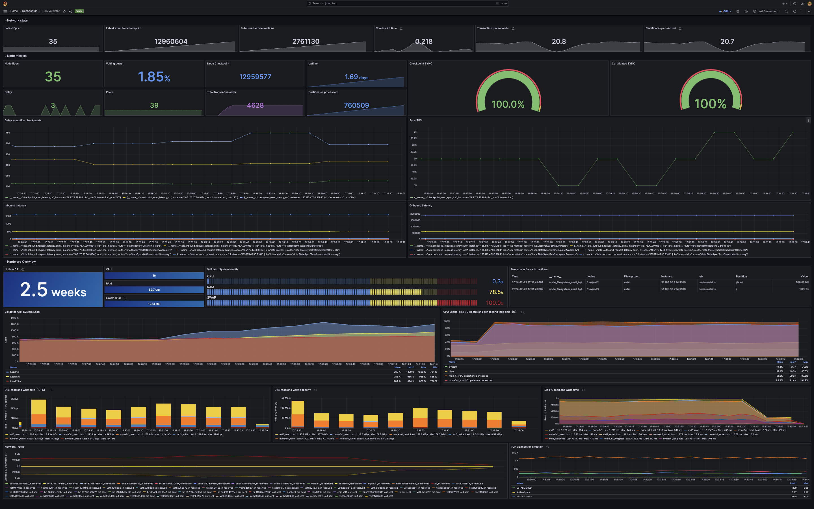

# Iota Tools 
### grafana dashboard + node exporter

In this repository, you will find tools and a simple guide to set up Grafana and Node Exporter for monitoring Iota validator.

### 1. Install and Configure Node Exporter

#### Download and Extract Node Exporter
```bash
wget https://github.com/prometheus/node_exporter/releases/download/v1.5.0/node_exporter-1.5.0.linux-amd64.tar.gz
tar xvfz node_exporter-1.5.0.linux-amd64.tar.gz --strip-components=1 node_exporter-1.5.0.linux-amd64/node_exporter
rm node_exporter-1.5.0.linux-amd64.tar.gz
```

#### Create a Systemd Service File

```bash
sudo tee /etc/systemd/system/node_exporter.service > /dev/null <<EOF
[Unit]
Description=Node Exporter
After=network.target
[Service]
User=$USER
ExecStart=$HOME/node_exporter
Restart=on-failure
RestartSec=5
[Install]
WantedBy=multi-user.target
EOF
```

#### Start and check Node Exporter
```bash
sudo systemctl daemon-reload
sudo systemctl enable node_exporter
sudo systemctl start node_exporter
sudo systemctl status node_exporter
```


### 2. Added model in prometheus

#### Setup grafana

To set up Grafana, follow the official installation guide here: [Grafana Installation Guide](https://github.com/grafana/grafana)

#### Import the Model

1. Open Grafana by navigating to `http://<your-grafana-url>:3000` in your browser.
2. Log in with your credentials (default: username: `admin`, password: `admin`).
3. On the left sidebar, click on **Dashboard** and then **Manage**.
4. Click the **Import** button at the top of the page.
5. In the **Import via Panel JSON** field, paste the URL of the GitHub repository or directly paste the JSON model from the repository
6. In the **Data Source** field, select **Prometheus**.
7. Click **Import** to load the dashboard into Grafana.

#### Added IOTA metrics in prometheus

```yml
  - job_name: "iota-metrics"
    static_configs:
      - targets: ['1.1.1.1:9184']
```
#### Added exporter in prometheus

```yml
  - job_name: "node-metrics"
    static_configs:
      - targets: ['1.1.1.1:9100']
```

### Now, the dashboard should be imported and connected to Prometheus, ready for use in Grafana.
